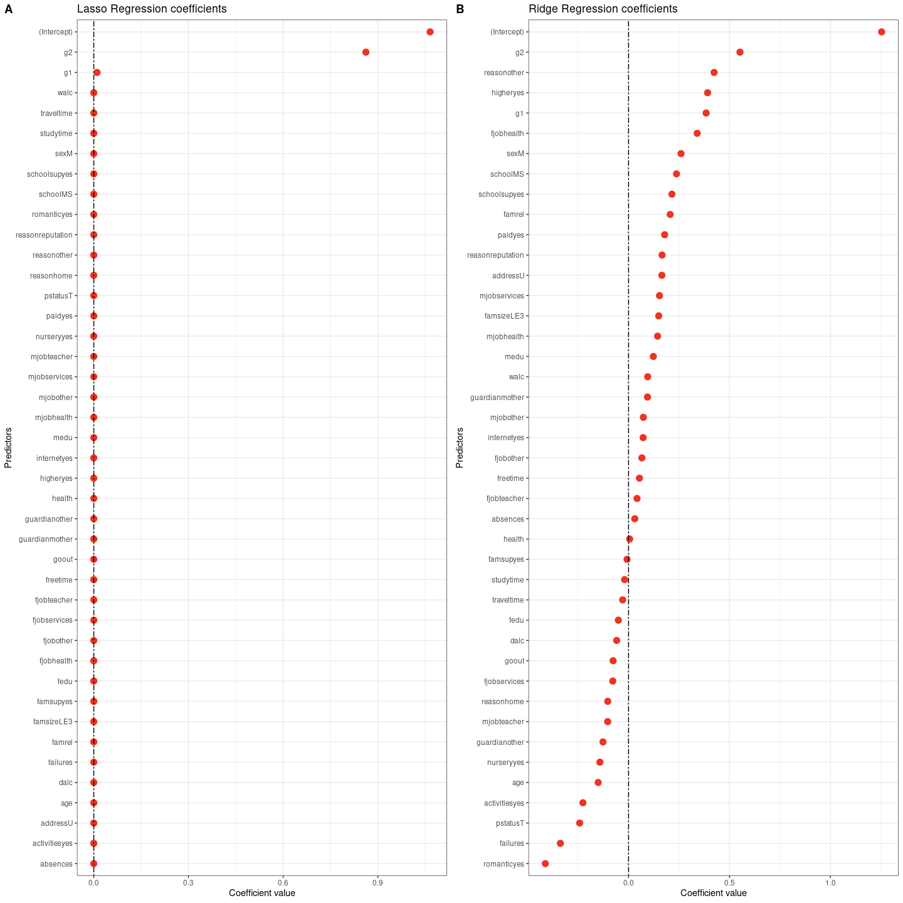

```{r setup, include=FALSE}
knitr::opts_chunk$set(echo = TRUE)
```

# Introduction
Education is one of the main key areas of investment that dominate the political agenda in the European Union (EU). Despite the recent global economic crisis, policymakers have set ambitious goals like reducing school dropouts and increasing the percentage of the population with an educational degree. With this kind of strategy, policymakers are trying to address the increasing social inequalities that affect the citizens of the EU (Busemeyer et al, 2018).

Achieving equality in education is recognized by the politicians as key, but among the EU members, there is variation in the socioeconomic factors that influence the citizens of each country. This kind of variation among countries makes it difficult to pass general bills that reduce education inequality in the EU. Because of this, it is important to investigate each country separately in order to draw conclusions that can potentially be generalized to the whole EU. (Hippe, Araujo and da Costa, 2016).

Portugal’s educational system is characterized by providing universal access to its citizens. This has led to reducing the number of schools dropouts, (having the lowest out-of-school rate at the high school level among OCDE members). Despite this, Portugal has one of the highest unemployment rates of recent graduates with upper secondary education and one of the lowest medium and high educational attainment (O.E.C.D, 2021).

In this report, I investigate the demographic, social, and school factors that influence the performance of students in the mathematics test. Specifically, I address the following questions, which factors determine the score in mathematics (A1) and which factors can be used to predict if a student fails or pass the test (A2). The main goal of this report is to develop predictive models for the final year grade (G3) using statistical learning methods. 

# Methods

For addressing which factors determine the score in mathematics (A1) I used multiple regression analysis, partial least squares regression, principal components regression, LASSO regression, and Ridge regression,  while for addressing which factors can be used to predict if a student fails or pass the test (A2) I used decision trees, Bagging, Random forests, Random forest with gradient boosting and k-Nearest Neighbor.

The data set was split into a training set containing 75% of the observations and testing set containing the rest of the observations. For the evaluation of all the models, I used the testing set. In the case of the linear models, I used the mean squared error on the testing data set for evaluating the fit of the models, and for the classification models, I estimated the accuracy, sensitivity, and specificity of each model using the test data set.

# Results 

## Exploratory study of the variables.

The data set used contains a total of 395 observations (with no missing values) of students from two schools Gabriela Pereira and Mousinho da Silveira. In total 34 variables were measured among students which 31 were considered as factors (Figure 1) and 3 were considered as numeric (g1, g2, g3).

In general, most of the students, come from the school called Gabriela Pereira (88%), live in most of the cases in urban areas (78%), travel approximately 1h to get to school (65%), dedicated 2h to studying (50%), failed almost no class (78%), do not receive extra class support from the school (87%), the parents support them to stay in school  (61%), attended to nursery school (70%), want to take higher education  (95%), have internet access (83%), have no romantic relationships (67) and have a low alcoholic consumption during the workday.  In terms of family, most of the students have families with sizes greater than 3 (71%) and have good family relationships (40% and 27%) and most of the parents have at least some degree of education. Also in terms of absences, there were 6 students with more than 30 absences (Figure 1).

All students took three tests, the first-period grade (g1), the second-period grade (g2), and the final grade (g3). All of these have a score that varies from 0 to 20 being 0 the lowest score possible. Overall among students, g1 had a mean value of 10.90 with a standard deviation of 3.31, g2 had a mean value of 10.71 and a standard deviation of 3.76 and g3 had a mean of 10.41 with a standard deviation of 4.5 (Table 1). It is worth mentioning that each of these variables has a high correlation with each other which gets less strong across periods (Table 2). Finally is important to mention that the proportion of students that got a score of 0 increased across tests. In the g1 test, a total of 0 students had a score of 0 while in the g2 and g3 a total of 13 and 38 got a score of 0 respectively. I used g3 as the response variable and g1 and g2 as predictors. No outliers or skewed distributions were found in any of these variables (Figure 2).

When each categorical variable was evaluated I couldn't find any dominating trend. This makes me think that the determinants of student success in the g3 test are a combination of different socioeconomic factors (Figure 3).

The zero (zeroVar) and near-zero variance (nzv) predictors are those categorical predictors that only have a unique or a highly extreme frequency of values. These kinds of predictors are characterized by having a fraction of unique values over the sample size is low (say 10 %) and having a ratio of the frequency of the most prevalent value to the frequency of the second most prevalent value is large (say around 20). I evaluated this in all the categorical and integer predictors and none of them have this problem (Kuhn and Johnson, 2013) (Table 3).


## Linear regression selection/dimension reduction methods (A1)

For answering which factors determine the score in mathematics (A1) I used a total of five models. The model with the worse performance was the best subset model (MLR) which showed the largest MSE in the test set while the Ridge regression and the LASSO regression showed the smallest test error (Table 4). After this process, I fitted both models to the full data set.

Figure 4 shows the coefficients from the LASSO regression and the Ridge regression. As expected (because of the high correlation between g1 and the predictors  g2 and g3) g2 and g1 have a high predictive power over the scores of g3, so students that scored high in the g1 and g2 will score high in the final exam. 


## Classification analysis (A2 and A3)

Overall most of the models evaluated had high accuracy in classifying which students pass (g3 scores > 10) and which students fail (g3 scores < 10). The worst performing model was the kNN model while the best performing was the Random forest with gradients boosting (Table 5). 

Random forest with gradients boosting model showed almost the same results like the ones obtained with the ridge regression where g1 and g2 have the largest importance on predicting which students fail and which ones pass. For these reasons, I decided to exclude g1 and g2 from the data set and re-run the models to determine which other factors predict the students that pass and fail (Figure 5).

After removing the g1 and g2 from the data set, all performance metrics decrease across all models, but still, the Random forest with gradients boosting is best performing since it has the greatest values of accuracy sensibility and specificity (Table 6).


## Summary of analysis results in context

Equality in education is one of the most important challenges of the EU and for achieving this goal it is necessary to employ different statistical techniques that guide the formulation of data-driven policies. In this report, I found that Random forest and Ridge regressions are adequate techniques for understanding which factors might influence students’ performance in schools of Portugal. Using Random forest I found that the main determinants of test scores are how well the student did in past tests (Figure 6). After taking out g1 and g2 from the analysis I found that the most important predictors of g3 scores are, the number of pass class failures (failures), the number of school absences (absences), and how much each student go out with friends (gouot) (Figure 6).         


On the other hand, using the ridge regression I found that the reason for choosing the school, if a student wants to take higher education, and the past scores (g1, g2) had a positive effect over the final score while the number of past class failures, if the students have a romantic relationship and the parent's cohabitation status have a negative effect over the final scores (Figure 4). 


Of all models considered in this report, I think this last one (Ridge regression) is the one that offers the most insights, mainly because with this model we can identify the most important predictors that have a positive and negative effect on school performance which could inform better policymakers.

# References

Busemeyer, M. R., Garritzmann, J. L., Neimanns, E., & Nezi, R. (2018). Investing in education in Europe: Evidence from a new survey of public opinion. Journal of European Social Policy, 28(1), 34-54.

Hippe, R., Araujo, L., & da Costa, P. D. (2016). Equity in education in Europe. Luxembourg: Publications Office of the European Union.

Indicators, O.E.C.D. (2021). Education at a Glance 2016. Editions OECD, 90.

Kuhn, M., & Johnson, K. (2013). Applied predictive modeling (Vol. 26, p. 43). New York: Springer.


# Figures

## Figure 1

\center 

{#id .class width=50% height=50%}
\center

## Figure 2

<p align="center">
{#id .class width=50% height=50%}
</p>

## Figure 3

 <center>

{#id .class width=50% height=50%}
 </center>

## Figure 4

{#id .class width=50% height=50%}

## Figure 5


## Figure 6


# Tables

## Table 1

<center>


</center>

<center>

## Table 2

{#id .class width=50% height=50%}

</center>


## Table 3

{#id .class width=50% height=50%}


## Table 4

{#id .class width=50% height=50%}

## Table 5

{#id .class width=75% height=75%}


# Table 6


